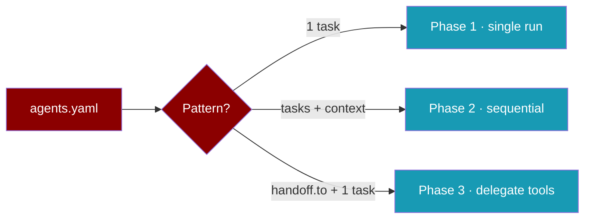

# Pydantic AI adapter

Run PraisonAI `agents.yaml` through [Pydantic AI](https://ai.pydantic.dev/) — type-safe agents with OpenAI and Gemini models.

**Requires:** `praisonai-frameworks` **0.1.9+**

---

## Quick start (3 steps)

### Step 1 — Install

```bash
pip install "praisonai-frameworks[pydantic-ai]"
```

With the PraisonAI CLI wrapper:

```bash
pip install "praisonai[pydantic-ai]"
```

### Step 2 — Set an API key

```bash
export OPENAI_API_KEY=your-key          # OpenAI (default)
# or
export GOOGLE_API_KEY=your-key          # Gemini
# or
export GEMINI_API_KEY=your-key
```

### Step 3 — Run an example

```bash
cd /path/to/PraisonAI-Frameworks
praisonai run examples/agents_pydantic_ai.yaml --framework pydantic_ai
```

Expected output banner:

```text
### Pydantic AI Output ###
OK
```

---

## Choose your path

Pick one way to run the same agent — all three use the same YAML shape.

| Path | Best for |
|------|----------|
| [YAML file](#yaml-file) | Config in repo, CI, teams |
| [CLI](#cli) | Quick one-off runs |
| [Python](#python) | Apps, scripts, tests |

### YAML file

Save as `agents.yaml`:

```yaml
framework: pydantic_ai
topic: Quick task
roles:
  helper:
    role: Helper
    goal: Answer briefly
    backstory: Helpful assistant
    tasks:
      answer:
        description: Reply with exactly OK.
        expected_output: OK
```

```bash
praisonai run agents.yaml --framework pydantic_ai
```

### CLI

```bash
praisonai agents.yaml --framework pydantic_ai
```

### Python

```python
from praisonai import PraisonAI

praisonai = PraisonAI(
    agent_file="examples/agents_pydantic_ai.yaml",
    framework="pydantic_ai",
)
print(praisonai.run())
```

Or with the adapter directly:

```python
from praisonai_frameworks.pydantic_ai.adapter import PydanticAiAdapter

config = {
    "framework": "pydantic_ai",
    "topic": "Quick task",
    "roles": {
        "helper": {
            "role": "Helper",
            "goal": "Answer briefly",
            "backstory": "Helpful assistant",
            "tasks": {
                "answer": {
                    "description": "Reply with exactly OK.",
                    "expected_output": "OK",
                }
            },
        }
    },
}
result = PydanticAiAdapter().run(
    config,
    [{"model": "openai/gpt-4o-mini", "api_key": "your-key"}],
    "Quick task",
    tools_dict={},
)
print(result)
```

---

## What you can build

The adapter maps your YAML to three execution modes (same pattern as OpenAI Agents / Google ADK):



| Phase | YAML pattern | What happens |
|-------|--------------|--------------|
| **1** | One role, one task | `Agent.run_sync` with instructions from role / goal / backstory |
| **2** | Multiple tasks with `context:` | Tasks run in order; prior outputs passed as context |
| **3** | `handoff.to` + **one** router task | Router gets `handoff_to_*` tools; delegates to specialists |

### Phase 2 — Sequential (try it)

```yaml
framework: pydantic_ai
topic: numbers
roles:
  writer:
    role: Writer
    goal: Write numbers only
    backstory: Concise writer
    tasks:
      draft:
        description: Reply with only the number 3.
        expected_output: "3"
      polish:
        description: Add 3 to the previous result. Reply with only the number.
        expected_output: "6"
        context:
          - draft
```

```bash
praisonai run examples/agents_pydantic_ai_sequential.yaml --framework pydantic_ai
```

### Phase 3 — Handoffs (try it)

One router role with a **single** task. Specialists have no tasks — the router delegates via tools.

```yaml
framework: pydantic_ai
topic: language help
roles:
  triage:
    role: Triage Agent
    goal: Route to the right specialist
    backstory: Detect language and delegate to the correct agent.
    handoff:
      to:
        - English Agent
        - French Agent
    tasks:
      route:
        description: Help the user with {topic}. Reply in the user's language.
        expected_output: A helpful reply in the correct language
  english:
    role: English Agent
    goal: Reply in English only
    backstory: English language specialist.
  french:
    role: French Agent
    goal: Reply in French only
    backstory: French language specialist.
```

```bash
praisonai run examples/agents_pydantic_ai_handoff.yaml --framework pydantic_ai
```

> **Note:** If you combine `handoff.to` with **multiple** tasks, execution falls back to sequential (OpenAI parity).

---

## Models

| Model in YAML / `llm_config` | Provider prefix | API key |
|------------------------------|-----------------|---------|
| `openai/gpt-4o-mini`, `gpt-4o-mini` | `openai:` | `OPENAI_API_KEY` |
| `gemini-2.0-flash`, `google/gemini-2.0-flash` | `google:` | `GOOGLE_API_KEY` or `GEMINI_API_KEY` |

Per-role override:

```yaml
roles:
  analyst:
    role: Analyst
    llm: gemini-2.0-flash
    goal: Analyse data
    backstory: Data expert
    tasks:
      report:
        description: Summarise {topic}
        expected_output: A short summary
```

---

## Example files

| File | Pattern |
|------|---------|
| `examples/agents_pydantic_ai.yaml` | Phase 1 — single task |
| `examples/agents_pydantic_ai_sequential.yaml` | Phase 2 — sequential + context |
| `examples/agents_pydantic_ai_handoff.yaml` | Phase 3 — handoff delegation |

---

## Limitations (v1)

| Feature | Status |
|---------|--------|
| Phases 1–3 (single, sequential, handoff) | Supported |
| pydantic-graph workflows | Not used |
| Workflow YAML with `framework: pydantic_ai` | Not supported |
| Built-in Pydantic AI capabilities (WebSearch, Thinking) | Not mapped |
| `output_schema` / structured deps | Not mapped |
| A2A broker | Not supported |
| Async-only tools | Skipped (sync tools only) |

---

## Troubleshooting

| Issue | Fix |
|-------|-----|
| `Pydantic AI requires an API key` | Set `OPENAI_API_KEY` or `GOOGLE_API_KEY` / `GEMINI_API_KEY` |
| Handoff tool errors | Ensure specialist `role:` strings match `handoff.to` entries exactly |
| `framework: pydantic_ai` not found | `pip install "praisonai-frameworks[pydantic-ai]>=0.1.9"` |
| Live test locally | `PRAISONAI_LIVE_TESTS=1 python -m pytest tests/integration/pydantic_ai_adapter/ -v` |

---

## See also

- [PraisonAI docs — Pydantic AI](https://docs.praison.ai/docs/framework/pydantic-ai)
- [Framework adapter plugins](https://docs.praison.ai/docs/features/framework-adapter-plugins)
